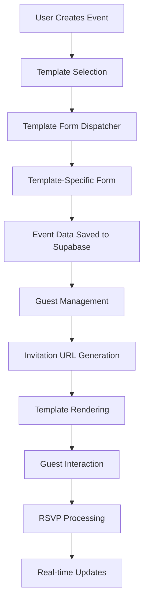

# UTSAVY Template System Documentation

## Table of Contents
1. [Overview](#overview)
2. [Architecture](#architecture)
3. [End-to-End Flow](#end-to-end-flow)
4. [Data Communication](#data-communication)
5. [URL Parameter Handling](#url-parameter-handling)
6. [Template File Structure](#template-file-structure)
7. [Adding New Templates](#adding-new-templates)
8. [Template Development Guide](#template-development-guide)
9. [PostMessage Communication](#postmessage-communication)
10. [Future Automation Prompts](#future-automation-prompts)

---

## Overview

The UTSAVY template system is a flexible, dynamic invitation management platform that supports multiple template types including internal React components and external iframe-based templates. The system handles data collection, template rendering, guest management, and real-time RSVP tracking.

**Key Features:**
- Dynamic template loading (internal React components or external URLs)
- Real-time guest status tracking
- PostMessage communication between platform and templates
- Comprehensive data validation and transmission
- Mobile-responsive design
- Multi-language support

---

## Architecture



### Core Components

1. **Template Registry** (`src/components/events/TemplateFormDispatcher.tsx`)
2. **URL Construction** (`src/utils/iframeMessaging.ts`)
3. **Guest Invitation Page** (`src/pages/GuestInvitationPage.tsx`)
4. **RSVP Services** (`src/services/simpleRSVPService.ts`)
5. **Template Components** (`src/templates/`)

---

## End-to-End Flow

### 1. Template Selection & Event Creation
```typescript
// User selects template from gallery
Template → TemplateFormDispatcher → Specific Form Component → Event Creation
```

### 2. Data Collection & Storage
```typescript
// Form submission flow
FormData → Validation (Zod) → Supabase Storage → Event Record Creation
```

### 3. Guest Management
```typescript
// Guest addition and invitation sharing
GuestForm → Bulk Import → Guest Records → Invitation URL Generation
```

### 4. Template Rendering
```typescript
// Template display flow
Guest URL Access → Data Retrieval → Template Loading → Real-time Communication
```

### 5. RSVP Processing
```typescript
// Guest response handling
Template Interaction → PostMessage → Platform Processing → Database Update → Real-time Sync
```

---

## Data Communication

### Internal Templates (React Components)
Internal templates receive data through props:

```typescript
interface TemplateProps {
  eventDetails: any;
  guestName: string;
  onAccept: (rsvpData?: any) => void;
  hasResponded: boolean;
  accepted: boolean;
  rsvpConfig?: RSVPConfig;
}
```

### External Templates (iframe-based)
External templates receive data through URL parameters and PostMessage:

```typescript
// URL Parameters
eventId, guestId, guestName, guestStatus, eventDetails, rsvpConfig...

// PostMessage
{
  type: 'INVITATION_LOADED',
  data: {
    eventDetails,
    guestName,
    status,
    rsvpFields,
    wishesEnabled
  }
}
```

---

## URL Parameter Handling

### constructInvitationUrl Function

Located in `src/utils/iframeMessaging.ts`, this function creates invitation URLs with appropriate parameters:

```typescript
export const constructInvitationUrl = (
  baseUrl: string,
  eventData: any,
  guestData: any,
  additionalParams: Record<string, string> = {}
): string => {
  // Template type detection
  const isRoyalWeddingTemplate = eventData.template?.component_name === 'RoyalWeddingTemplate';
  
  if (isRoyalWeddingTemplate) {
    // Comprehensive URL parameters for Royal Wedding template
    // Individual parameters: groomName, brideName, weddingDate, etc.
    // JSON parameters: brideFamily, groomFamily, photos, events, contacts
  } else {
    // External template handling
    // Comprehensive data structure passed as URL parameters
  }
}
```

### URL Parameter Types

**Basic Parameters:**
- `eventId` - Unique event identifier
- `guestId` - Unique guest identifier
- `guestName` - Guest's display name
- `guestStatus` - pending/viewed/accepted/submitted

**Event Data Parameters:**
- `groomName`, `brideName` - Couple names
- `weddingDate`, `weddingTime` - Event timing
- `venueName`, `venueAddress` - Location details

**Complex JSON Parameters:**
- `brideFamily`, `groomFamily` - Family member details
- `photos` - Photo gallery data
- `events` - Multi-event details
- `contacts` - Contact information
- `rsvpConfig` - RSVP configuration

---

## Template File Structure

### Internal Templates
```
src/
├── templates/
│   ├── WeddingInvitation01Template.tsx    # Main template component
│   └── ...
├── components/
│   └── invitations/
│       └── wedding-01/                     # Template-specific components
│           ├── Countdown.tsx
│           ├── CoupleIllustration.tsx
│           ├── EventCard.tsx
│           └── ...
```

### External Templates
External templates are hosted independently and integrated via iframe URLs.

### Template Structure Requirements

**Internal Template Example:**
```typescript
// src/templates/NewTemplate.tsx
import { TemplateProps } from '@/types';

export const NewTemplate = ({
  eventDetails,
  guestName,
  onAccept,
  hasResponded,
  accepted,
  rsvpConfig
}: TemplateProps) => {
  return (
    <div className="min-h-screen">
      {/* Template content */}
      <RSVPSection 
        guestName={guestName}
        rsvpConfig={rsvpConfig}
        onAccept={onAccept}
        // ... other props
      />
    </div>
  );
};
```

---

## Adding New Templates

### Step 1: Create Template Component

For internal templates, create a new component in `src/templates/`:\

```typescript
// src/templates/BirthdayTemplate.tsx
import { TemplateProps } from '@/types';

export const BirthdayTemplate = (props: TemplateProps) => {
  // Template implementation
  return <div>Birthday Template Content</div>;
};
```

### Step 2: Register Template in Database

Add template record to Supabase `templates` table:

```sql
INSERT INTO templates (
  name, 
  component_name, 
  fields, 
  pages, 
  template_type,
  thumbnail_url
) VALUES (
  'Birthday Celebration',
  'BirthdayTemplate',
  '{\\\"celebrant_name\\\": {\\\"type\\\": \\\"text\\\", \\\"label\\\": \\\"Celebrant Name\\\", \\\"required\\\": true}}',
  '[\\\"main\\\"]',
  'internal',
  '/thumbnails/birthday.jpg'
);
```

### Step 3: Create Form Component

Create a form component in `src/components/events/forms/`:\

```typescript
// src/components/events/forms/BirthdayTemplateForm.tsx
export const BirthdayTemplateForm = ({ template, onSubmit, onBack }) => {
  // Form implementation with react-hook-form and zod validation
};
```

### Step 4: Update Template Dispatcher

Add the new template to `src/components/events/TemplateFormDispatcher.tsx`:\

```typescript
switch (template.component_name) {
  case 'BirthdayTemplate':
    return <BirthdayTemplateForm {...formProps} />;
  // ... other cases
}
```

### Step 5: Update Routing (if needed)

If using internal templates, ensure the template is imported and can be rendered by the platform.

---

## Template Development Guide

### Required Props Interface

All internal templates must implement the `TemplateProps` interface:

```typescript
interface TemplateProps {
  eventDetails: any;           // Event data from form submission
  guestName: string;          // Current guest's name
  onAccept: (rsvpData?: any) => void;  // RSVP acceptance handler
  hasResponded: boolean;      // Guest response status
  accepted: boolean;          // Acceptance status
  rsvpConfig?: RSVPConfig;    // RSVP configuration
}
```

### Styling Guidelines

- Use Tailwind CSS with semantic tokens
- Follow responsive design principles
- Use design system colors and typography
- Ensure accessibility compliance

### Component Structure

```typescript
export const MyTemplate = (props: TemplateProps) => {
  const [view, setView] = useState('welcome');

  // Welcome screen component
  const WelcomeView = () => (
    <div>
      <button onClick={() => setView('invitation')}>
        Enter Invitation
      </button>
    </div>
  );

  // Main invitation component
  const InvitationView = () => (
    <div>
      {/* Template content */}
      <RSVPSection {...props} />
    </div>
  );

  return view === 'welcome' ? <WelcomeView /> : <InvitationView />;
};
```

### Required Features

1. **Welcome Screen** - Entry point with guest personalization
2. **Event Details Display** - Show all relevant event information
3. **RSVP Integration** - Include RSVPSection component
4. **Mobile Responsiveness** - Ensure mobile-first design
5. **Real-time Updates** - Support dynamic status changes

---

## PostMessage Communication

### Supported Message Types

```typescript
const MESSAGE_TYPES = {
  TEMPLATE_READY: 'TEMPLATE_READY',
  INVITATION_LOADED: 'INVITATION_LOADED',
  RSVP_ACCEPTED: 'RSVP_ACCEPTED',
  RSVP_SUBMITTED: 'RSVP_SUBMITTED',
  GUEST_ACCEPTANCE: 'GUEST_ACCEPTANCE',
  // Wish management
  SUBMIT_NEW_WISH: 'SUBMIT_NEW_WISH',
  APPROVE_WISH: 'APPROVE_WISH',
  // ... more types
};
```

### Message Flow

1. **Template to Platform:**
```typescript
// Template sends ready signal
parent.postMessage({
  type: 'TEMPLATE_READY'
}, '*');
```

2. **Platform to Template:**
```typescript
// Platform sends initial data
iframe.contentWindow.postMessage({
  type: 'INVITATION_LOADED',
  data: {
    eventDetails,
    guestName,
    status,
    rsvpFields
  }
}, targetOrigin);
```

### External Template Integration

External templates must implement PostMessage listeners:

```javascript
// In external template
window.addEventListener('message', (event) => {
  if (event.data.type === 'INVITATION_LOADED') {
    // Initialize template with received data
    initializeTemplate(event.data.data);
  }
});

// Send ready signal
parent.postMessage({ type: 'TEMPLATE_READY' }, '*');
```

---

## Future Automation Prompts

### Template Creation Prompts

1. **Generate New Wedding Template**
```
"Generate a new wedding invitation template named 'Elegant Garden Wedding' with fields for couple names, wedding date, venue details, and photo gallery. Style it with elegant typography, floral motifs, and soft green color palette. Include welcome screen, main invitation view, and RSVP section."
```

2. **Create Birthday Template**
```
"Create a new birthday invitation template named 'Birthday Celebration' with fields for celebrant name, birthday date, party time, venue, and theme. Style with vibrant colors, balloon graphics, and party elements. Include age display, gift registry section, and RSVP functionality."
```

3. **Corporate Event Template**
```
"Generate a corporate event invitation template named 'Business Conference' with fields for event title, company name, date/time, venue, agenda, and speaker details. Use professional styling with corporate colors, clean typography, and business-appropriate design elements."
```

### Template Enhancement Prompts

4. **Add Animation Features**
```
"Add entrance animations to the WeddingInvitation01Template using Framer Motion. Include fade-in effects for sections, hover animations for interactive elements, and smooth transitions between welcome and main views."
```

5. **Enhance Mobile Experience**
```
"Improve mobile responsiveness for all templates by optimizing touch interactions, adjusting font sizes for mobile screens, and ensuring proper spacing on small devices. Add swipe gestures for photo galleries."
```

6. **Add Accessibility Features**
```
"Enhance template accessibility by adding proper ARIA labels, keyboard navigation support, screen reader compatibility, and high contrast mode options. Ensure all interactive elements are accessible."
```

### System Enhancement Prompts

7. **Template Preview System**
```
"Create a comprehensive template preview system that allows users to see real-time previews while filling out event forms. Include side-by-side form and preview layout with instant updates."
```

8. **Template Analytics**
```
"Implement template analytics to track template usage, guest engagement rates, RSVP conversion rates, and popular template features. Create dashboard for template performance insights."
```

9. **Template Customization**
```
"Add template customization features allowing users to modify colors, fonts, and layout elements. Include color picker, font selector, and layout options while maintaining template integrity."
```

### Integration Prompts

10. **Social Media Integration**
```
"Add social media sharing capabilities to templates including Instagram Stories templates, Facebook event integration, and WhatsApp sharing with custom preview images."
```

11. **Calendar Integration**
```
"Implement calendar integration allowing guests to add events directly to Google Calendar, Apple Calendar, and Outlook from the invitation templates."
```

12. **Multi-language Support**
```
"Add internationalization support to templates enabling multi-language invitations with proper text direction, date formatting, and cultural considerations for different regions."
```

### Advanced Features Prompts

13. **AI Template Generation**
```
"Create an AI-powered template generator that creates custom templates based on event type, theme preferences, and style descriptions provided by users."
```

14. **Template Marketplace**
```
"Build a template marketplace where designers can submit custom templates, users can purchase premium templates, and revenue sharing is handled automatically."
```

15. **Template Version Control**
```
"Implement template version control system allowing template updates without breaking existing invitations, rollback capabilities, and migration tools for template upgrades."
```

---

## Conclusion

The UTSAVY template system provides a robust foundation for creating and managing digital invitations. With proper understanding of the data flow, communication protocols, and development guidelines, developers can create engaging, interactive templates that enhance the user experience while maintaining system reliability and performance.

For additional support or questions about template development, refer to the source code documentation and existing template implementations as reference examples.
