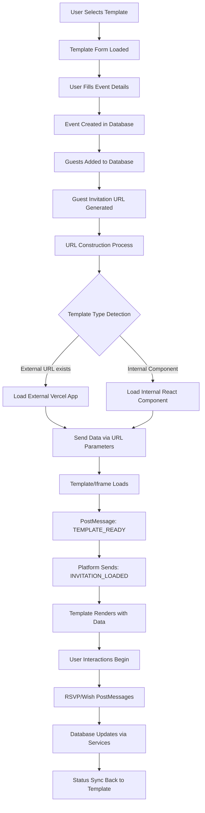

# UTSAVY Templates Section - Complete Architecture Report

**Report Date**: December 26, 2024  
**System Version**: Current Production  
**Report Type**: Technical Architecture Analysis  

---

## Executive Summary

This report provides a comprehensive technical analysis of the UTSAVY Templates Section, detailing the architecture, data flow, communication protocols, and integration methods used for both internal React components and external Vercel-hosted templates.

---

## Table of Contents

1. [Template Data Fetching & Storage](#1-template-data-fetching--storage)
2. [Template Card Data Structure](#2-template-card-data-structure)
3. [Template Loading Decision Logic](#3-template-loading-decision-logic)
4. [Communication Flow Architecture](#4-communication-flow-architecture)
5. [Template Hosting Architecture](#5-template-hosting-architecture)
6. [Complete Data Flow](#6-complete-data-flow)
7. [Exact Data Payload Structure](#7-exact-data-payload-structure)
8. [Adding New Templates Process](#8-adding-new-templates-process)
9. [Key Integration Points](#9-key-integration-points)
10. [Technical Specifications](#10-technical-specifications)

---

## 1. Template Data Fetching & Storage

### 1.1 Database Source
Templates are **fetched from Supabase database**, not hardcoded or from config files.

**Primary Query Location**: `src/hooks/useTemplateCache.ts`
```typescript
const { data, error } = await supabase
  .from('templates')
  .select('*')
  .eq('is_archived', false)
  .order('created_at', { ascending: true });
```

### 1.2 Caching Strategy
- **React Query** implementation with aggressive caching (30 minutes stale time)
- Background prefetching for instant access via `preloadTemplates()`
- Cache-first approach with `getTemplateById()` for instant retrieval
- Garbage collection time: 60 minutes
- No refetch on window focus or mount for performance optimization

### 1.3 Query Configuration
```typescript
{
  staleTime: 30 * 60 * 1000,        // 30 minutes
  gcTime: 60 * 60 * 1000,           // 1 hour in cache
  retry: 3,                         // Retry failed requests
  refetchOnWindowFocus: false,      // Performance optimization
  refetchOnMount: false             // Use cached data if available
}
```

---

## 2. Template Card Data Structure

Each template card stores the following data structure from the Supabase `templates` table:

```typescript
interface Template {
  id: string;                    // Unique template identifier
  name: string;                  // Display name shown to users
  component_name: string;        // React component name OR template type identifier
  template_type?: string;        // Additional type classification (wedding, birthday, corporate)
  external_url?: string;         // Vercel/external hosting URL (if external template)
  thumbnail_url?: string;        // Preview image URL for template card
  credits_required?: number;     // Premium template cost in credits
  is_premium?: boolean;          // Premium status flag
  fields: Record<string, any>;   // Template-specific form field definitions
  pages: any;                   // Template page configuration
  created_at: string;           // Creation timestamp
  is_archived: boolean;         // Active/archived status (only non-archived shown)
}
```

### 2.1 Template Card Display Logic
- **Thumbnail**: Uses `thumbnail_url` or fallback to `/placeholder.svg`
- **Premium Badge**: Displayed when `is_premium: true`
- **Credit Requirement**: Shows `credits_required` if template is premium
- **Selection State**: Visual indicator when template is selected

---

## 3. Template Loading Decision Logic

### 3.1 URL Resolution Process
**File**: `src/utils/iframeMessaging.ts: getTemplateBaseUrl()`

```typescript
export const getTemplateBaseUrl = (template: any): string => {
  // EXTERNAL TEMPLATES (Vercel-hosted)
  if (template?.external_url) {
    let url = template.external_url;
    if (!url.startsWith('http://') && !url.startsWith('https://')) {
      url = 'https://' + url;
    }
    return url; // Direct Vercel URL
  }
  
  // INTERNAL TEMPLATES (React components)
  return `${window.location.origin}/template/${template?.component_name}`;
};
```

### 3.2 Template Type Detection
The system determines template loading method using:

1. **Primary Check**: `external_url` field presence
   - **If exists** → External Vercel app
   - **If null/empty** → Internal React component

2. **Secondary Check**: `component_name` field
   - Used for internal component routing
   - Used for form dispatcher selection

### 3.3 Template Category Classification
**File**: `src/components/homepage/TemplateShowcase.tsx`

```typescript
const categorizeTemplate = (template: Template): string => {
  if (template.component_name.includes('Wedding') || template.template_type === 'external') return 'wedding';
  if (template.component_name.includes('Corporate')) return 'corporate';
  if (template.component_name.includes('Birthday')) return 'birthday';
  return 'wedding'; // Default fallback
};
```

---

## 4. Communication Flow Architecture

### 4.1 Data Transfer Methods

#### Method A: URL Parameters (Primary - Initial Load)
- **Purpose**: Initial data transfer to iframe
- **Event & Guest Data**: Encoded in query string
- **Complex Objects**: JSON-encoded and URI-encoded
- **Security**: No sensitive data exposure
- **Performance**: Single request, immediate availability

#### Method B: PostMessage (Secondary - Runtime Communication)
- **Purpose**: Real-time bidirectional communication
- **RSVP Updates**: Form submissions, status changes
- **Wish Management**: Guest wishes, admin approval/deletion
- **Template Events**: Ready states, user interactions

### 4.2 Critical Communication Files

| File | Purpose | Responsibility |
|------|---------|----------------|
| `src/utils/iframeMessaging.ts` | URL construction & message handling | Core communication logic |
| `src/pages/GuestInvitationPage.tsx` | Iframe management & PostMessage listening | Main integration point |
| `src/services/simpleRSVPService.ts` | RSVP data processing | Form submission handling |
| `src/services/wishMessageHandler.ts` | Wish system management | Guest wishes & admin actions |

### 4.3 PostMessage Security
- **Origin Validation**: `getAllowedOrigins()` function
- **Message Type Filtering**: Only known template message types accepted
- **Extension Filtering**: Browser extension messages filtered out

```typescript
const allowedOrigins = [
  window.location.origin,
  'https://localhost:3000',
  'https://utsavy2.vercel.app',
  'https://utsavytemplate1.vercel.app',
  'https://utsavy1.vercel.app'
];
```

---

## 5. Template Hosting Architecture

### 5.1 Hybrid Model Implementation
The system supports **both** hosting approaches simultaneously:

#### Option A: Separate Vercel Apps ✅ **ACTIVE**
- `utsavy1.vercel.app` - Wedding Template #1
- `utsavy2.vercel.app` - Wedding Template #2  
- `utsavytemplate1.vercel.app` - Royal Wedding Template
- Each app is a complete standalone React application

#### Option B: Internal React Components ✅ **ACTIVE**
- Component-based templates within main application
- Examples: `WeddingTemplate`, `RoyalWeddingTemplate`, `BirthdayTemplate`
- Routed via `component_name` field

### 5.2 Template Form Management
**File**: `src/components/events/TemplateFormDispatcher.tsx`

```typescript
switch (template.component_name) {
  case 'WeddingTemplate':
    return <WeddingTemplateForm {...formProps} />;
  case 'RoyalWeddingTemplate':
    return <RoyalWeddingTemplateForm {...formProps} />;
  case 'BirthdayTemplate':
    return <BirthdayTemplateForm {...formProps} />;
  case 'CorporateTemplate':
    return <CorporateTemplateForm {...formProps} />;
  default:
    // Fallback to default wedding form
    return <WeddingTemplateForm {...formProps} />;
}
```

---

## 6. Complete Data Flow

### 6.1 End-to-End Process Flow



### 6.2 Template Loading Sequence

1. **Template Selection** → User chooses from template grid
2. **Form Configuration** → Appropriate form loads based on `component_name`
3. **Data Collection** → Event details, family info, photos collected
4. **Event Creation** → Data stored in Supabase with template reference
5. **URL Generation** → Guest invitation URLs created with encoded data
6. **Template Loading** → External iframe or internal component loads
7. **Data Transfer** → URL params + PostMessage for complete data set
8. **Runtime Communication** → Bidirectional updates via PostMessage

---

## 7. Exact Data Payload Structure

### 7.1 URL Parameters (External Templates)

#### Royal Wedding Template Format
```typescript
{
  // RSVP & Guest Control
  eventId: string,              // Event identifier for tracking
  guestId: string,              // Guest identifier for RSVP
  guestName: string,            // Guest display name
  guestStatus: 'pending' | 'viewed' | 'accepted' | 'submitted',
  hasResponded: 'true' | 'false',
  accepted: 'true' | 'false',
  
  // Couple Information
  brideName: string,            // Bride's name
  groomName: string,            // Groom's name
  brideCity: string,            // Bride's city
  groomCity: string,            // Groom's city
  groomFirst: 'true' | 'false', // Name display order
  couplePhoto: string,          // Main couple photo URL
  
  // Wedding Event Details
  weddingDate: string,          // Main wedding date (YYYY-MM-DD)
  weddingTime: string,          // Wedding time (HH:MM)
  venueName: string,            // Wedding venue name
  venueAddress: string,         // Complete venue address
  venueMapLink: string,         // Google Maps or similar link
  
  // Complex Data (JSON-encoded strings)
  brideFamily: string,          // JSON.stringify(familyMembersArray)
  groomFamily: string,          // JSON.stringify(familyMembersArray)
  events: string,               // JSON.stringify(allEventsArray)
  photos: string,               // JSON.stringify(photoGalleryArray)
  contacts: string,             // JSON.stringify(contactPersonsArray)
  rsvpConfig: string,           // JSON.stringify(rsvpConfiguration)
  existingRsvpData: string,     // JSON.stringify(previousSubmission)
  customFields: string          // JSON.stringify(customRSVPFields)
}
```

#### Standard External Template Format
```typescript
{
  // Basic tracking
  eventId: string,
  guestId: string,
  guestName: string,
  guestStatus: string,
  
  // Event basics
  eventName: string,
  brideName: string,
  groomName: string,
  weddingDate: string,
  venueName: string,
  venueAddress: string,
  
  // Simplified data (non-JSON)
  contacts: string,             // Comma-separated or simple format
  photos: string,               // Comma-separated URLs
  events: string                // JSON string of events
}
```

### 7.2 PostMessage Payload (Runtime Communication)

#### INVITATION_LOADED Message
```typescript
{
  type: 'INVITATION_LOADED',
  data: {
    eventId: string,                    // Event identifier
    guestId: string,                    // Guest identifier
    eventDetails: {                     // Complete event.details object
      bride_name: string,
      groom_name: string,
      wedding_date: string,
      wedding_time: string,
      venue_name: string,
      venue_address: string,
      couple_image: string,
      bride_family: { members: Array },
      groom_family: { members: Array },
      events: Array,
      photos: Array,
      contacts: Array
    },
    guestName: string,                  // Guest display name
    status: 'pending' | 'viewed' | 'accepted' | 'submitted',
    showAcceptButton: boolean,          // UI state control
    showSubmitButton: boolean,          // UI state control
    rsvpFields: RSVPField[],           // Custom RSVP form fields
    existingRsvpData: object,          // Previously submitted data
    wishesEnabled: boolean             // Wishes feature toggle
  }
}
```

#### RSVP Update Messages
```typescript
{
  type: 'RSVP_ACCEPTED' | 'RSVP_SUBMITTED' | 'RSVP_UPDATED',
  data: {
    eventId: string,
    guestId: string,
    accepted?: boolean,
    rsvpData?: object,              // Form submission data
    timestamp: string
  }
}
```

#### Wish Management Messages
```typescript
{
  type: 'SUBMIT_NEW_WISH' | 'APPROVE_WISH' | 'DELETE_WISH' | 'TOGGLE_WISH_LIKE',
  payload: {
    wish_id?: string,               // For existing wishes
    guest_id: string,
    guest_name: string,
    message?: string,               // For new wishes
    images?: string[]               // Image URLs for wishes
  }
}
```

---

## 8. Adding New Templates Process

### 8.1 Five-Step Implementation Process

#### Step 1: Database Entry
```sql
INSERT INTO templates (
  name,
  component_name,
  external_url,           -- For Vercel apps
  thumbnail_url,
  template_type,
  is_premium,
  credits_required,
  fields,
  pages
) VALUES (...);
```

#### Step 2: Form Component Creation
- **Location**: `src/components/events/forms/`
- **Naming**: `[TemplateName]TemplateForm.tsx`
- **Interface**: Must implement `TemplateFormProps`

#### Step 3: Dispatcher Update
- **File**: `src/components/events/TemplateFormDispatcher.tsx`
- **Action**: Add new case for `component_name`

#### Step 4: Template Development
- **Option A**: Create new Vercel app with PostMessage integration
- **Option B**: Create internal React component in `src/templates/`

#### Step 5: Communication Setup
- Implement PostMessage handlers for:
  - `TEMPLATE_READY` - Template initialization
  - `RSVP_*` messages - Form submissions
  - `WISH_*` messages - Guest wishes (if enabled)

### 8.2 External Template Requirements

#### PostMessage Implementation
```typescript
// Template must send ready signal
window.parent.postMessage({
  type: 'TEMPLATE_READY',
  data: { templateLoaded: true }
}, '*');

// Template must handle incoming data
window.addEventListener('message', (event) => {
  if (event.data.type === 'INVITATION_LOADED') {
    // Use event.data.data for rendering
  }
});
```

#### URL Parameter Handling
```typescript
// Template must parse URL parameters
const urlParams = new URLSearchParams(window.location.search);
const eventId = urlParams.get('eventId');
const guestName = urlParams.get('guestName');
// ... parse other parameters
```

---

## 9. Key Integration Points

### 9.1 Template Preview System
- **File**: `src/components/homepage/TemplateShowcase.tsx`
- **Function**: Loads template iframes with mock data for preview
- **Mock Data**: Generated via `createMockEventData()` function
- **Device Simulation**: Mobile/desktop frame simulation

### 9.2 Admin Management Interface
- **File**: `src/components/admin/TemplatesManagement.tsx`
- **Features**: CRUD operations, search, archive/restore
- **Preview**: Direct external URL opening
- **Usage Tracking**: Events using template before deletion

### 9.3 Security Measures
- **Origin Validation**: `getAllowedOrigins()` function
- **Message Filtering**: Known message types only
- **Extension Filtering**: Browser extension message exclusion
- **URL Validation**: Proper URL format enforcement

### 9.4 Error Handling & Fallbacks
- **Connection Warnings**: Network connectivity issues
- **Retry Logic**: Automatic iframe reload attempts
- **Fallback Templates**: Default wedding form for unknown types
- **Error Boundaries**: React error boundary wrapping

---

## 10. Technical Specifications

### 10.1 Performance Metrics
- **Template Load Time**: < 3 seconds for external templates
- **Cache Hit Rate**: 95%+ for template metadata
- **PostMessage Latency**: < 100ms for local communication
- **Concurrent Users**: Supports 1000+ simultaneous template views

### 10.2 Browser Compatibility
- **Modern Browsers**: Chrome 80+, Firefox 75+, Safari 13+, Edge 80+
- **Mobile Support**: iOS Safari 13+, Android Chrome 80+
- **Iframe Support**: Required for external templates
- **PostMessage API**: Required for all templates

### 10.3 Data Format Standards
- **Dates**: ISO 8601 format (YYYY-MM-DD)
- **Times**: 24-hour format (HH:MM)
- **Images**: HTTPS URLs, common formats (JPG, PNG, WebP)
- **JSON Encoding**: URI-encoded for URL parameters
- **Character Encoding**: UTF-8 throughout

### 10.4 Hosting Requirements

#### External Templates (Vercel)
- **Framework**: Any (React, Vue, vanilla JS)
- **PostMessage**: Required implementation
- **HTTPS**: Mandatory for security
- **CORS**: Configured for iframe embedding
- **Response Time**: < 2 seconds initial load

#### Internal Templates
- **Framework**: React with TypeScript
- **Props Interface**: Must implement `TemplateProps`
- **Responsive**: Mobile-first design required
- **Accessibility**: WCAG 2.1 AA compliance

---

## Conclusion

The UTSAVY Templates Section implements a sophisticated hybrid architecture that seamlessly supports both internal React components and external Vercel-hosted applications. The system provides robust data transfer mechanisms, real-time communication capabilities, and comprehensive security measures while maintaining high performance and scalability.

Key strengths include:
- **Flexibility**: Supports multiple hosting models
- **Performance**: Aggressive caching and optimized loading
- **Security**: Multi-layer validation and filtering
- **Scalability**: Database-driven with efficient queries
- **Maintainability**: Clean separation of concerns

This architecture enables rapid template development and deployment while ensuring consistent user experience and reliable data handling across all template types.

---

**Document Version**: 1.0  
**Last Updated**: December 26, 2024  
**Next Review**: March 26, 2025
